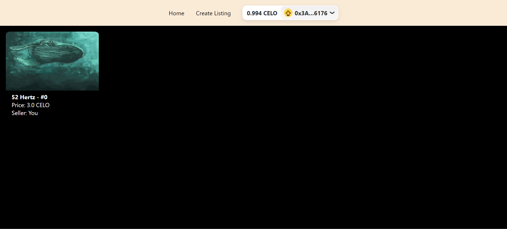
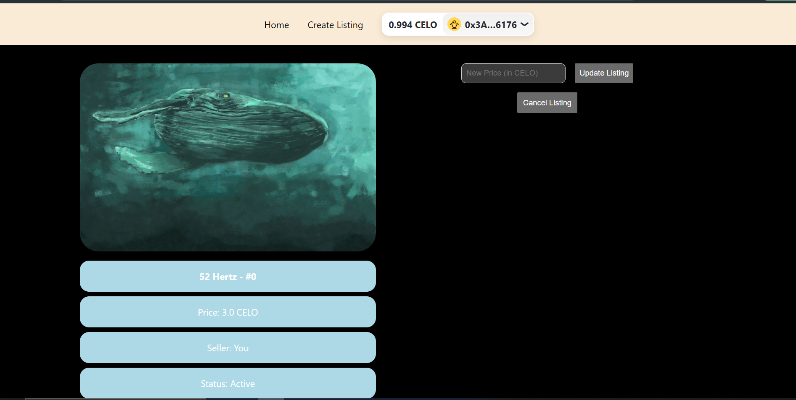

# NFT Marketplace Using Celo Blockchain

We've all heard of OpenSea, and maybe even of other marketplaces such as LooksRare. These platforms allow users to buy and sell all sorts of NFTs on their platforms, bringing a decentralized market to these digital mediums.

We Built OUR OWN NFT marketplace, similar to OpenSea, completely from scratch on Celo!

## Tools Used

We used a bunch of developer tools like 

    Hardhat
    NextJS (React)
    Celo
    The Graph
    Rainbowkit
    Wagmi
    Ethers.js
    Metamask / Alfajores Wallet
    Strong understanding of Solidity Events

## Project illustration

##  How to Use?

        Clone the Repository
        Open this Cloned folder
        Navigate to frontend by typing `cd frontend` in the current directory
        Run `npm install`
        Run `npm run dev`
        
